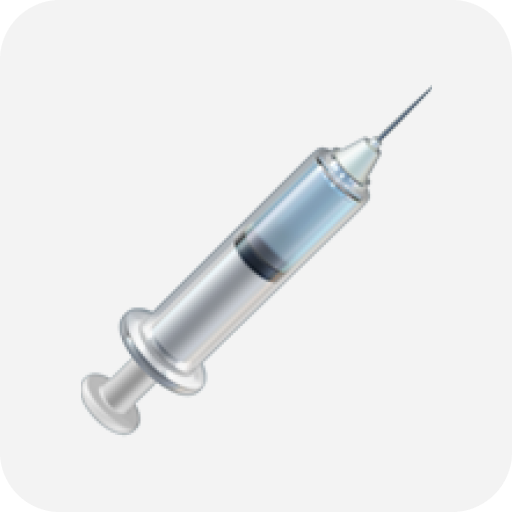

<div align=center></div>
<h1 align=center>Vaccine Tracker</h1>


## 📖 Description

💉 A Slack bot that notify you when a nearby vaccine center has an available appointments within the next 24hrs. (only working in France)

This project was made because at the date it was made (15th May, 2021), in France, when you are between 18 and 55 years old you can only get vaccinated by taking an appointment on remaining schedule within the 24 hours.

## 🛠️ Install

```bash
$ npm install

$ export SLACK_SIGNING_SECRET=<your slack signing token>

$ export SLACK_BOT_TOKEN=<your slack bot key>

$ npm run start
```

## 👨🏻‍💻 Developer

- Quentin Eude
  - [Github](https://github.com/qeude)
  - [LinkedIn](https://www.linkedin.com/in/quentineude/)
